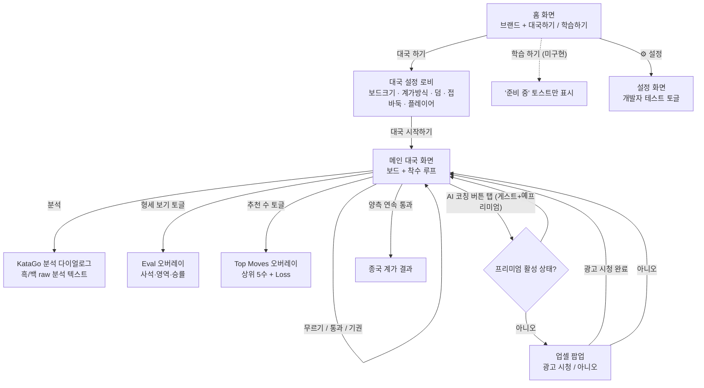
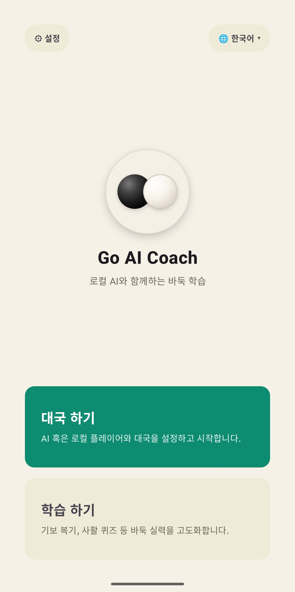
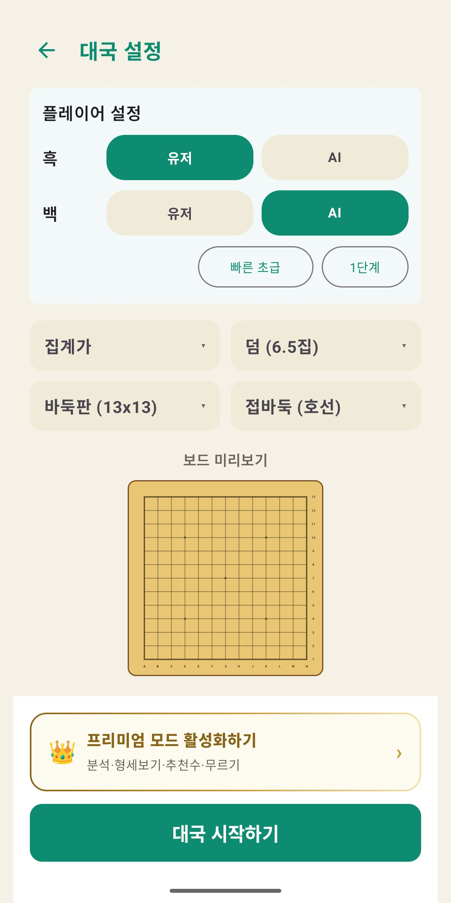
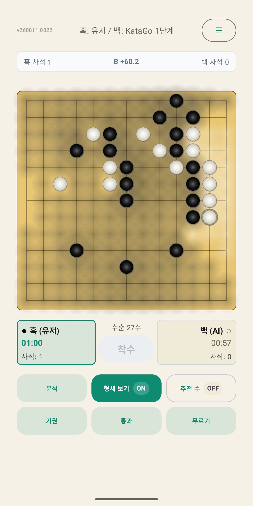
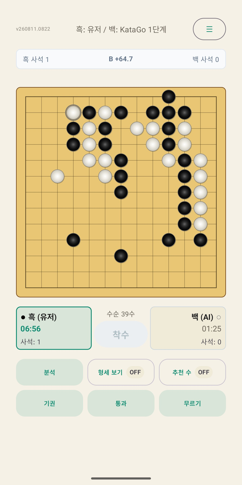

# Go AI Coach — 기획 디자이너 핸드오프

버전: v0.1.2 (VERSION_CODE=3) · 스냅샷 일자: 2026-08-11
스크린샷 출처: 로컬 에뮬레이터(Pixel 7 API 35) 실기 캡처, 합성 없음

> 이 파일은 보관·diff용 원본이다. 디자이너에게 실제로 보낼 파일은 같은 폴더의
> `go_ai_coach_handoff.html`(스크린샷 내장, 오프라인에서도 열림) 하나면 충분하다.

## 1. 개요

로컬 KataGo 엔진으로 대국·분석·코칭을 제공하는 Android 바둑 학습 앱.

- **핵심 가치**: 서버 없이 기기에서 직접 도는 AI 코치 — 추천 수·형세 판단·착수 리뷰(색상 피드백)가 핵심 차별점.
- **지금 이 빌드에서 꺼진 것**: 로그인, 인앱결제. 컴파일타임 플래그로 비활성화(2026-08-10/11). 온보딩 없이 홈으로 직행하고, 프리미엄은 광고 시청 1시간 한정 활성화만 동작한다.
- **타겟 사용자**: 바둑을 처음 배우는 입문자부터, 자신의 실수를 구체적으로 짚어줄 코치가 필요한 중급자까지.
- **보드/규칙 커버리지**: 9x9·13x13·19x19, 계가 방식(면적/집), 덤, 접바둑. 4개 국어(한/영/일/중) UI.

## 2. 유저 플로우

실기 조작으로 확인한 현재 화면 전환. 점선은 아직 구현되지 않은 경로.

홈에서 시작해 대국 설정을 거쳐 실제 플레이로 들어가는 경로. "학습 하기"는 UI만 있고 기능은 없는 상태(점선), AI 코칭 버튼은 프리미엄 상태에 따라 업셀 팝업으로 분기한다.

## 3. 화면별 스펙

### 3.1 홈 화면 (`GoCoachHomeScreen`)

- **대국 하기** — 메인 CTA. 대국 설정 로비로 이동.
- **학습 하기** — 기보 복기·사활 퀴즈 컨셉이지만 현재 "준비 중" 토스트만 표시, 실기능 없음.
- 좌상단 **설정**, 우상단 **언어 선택**(4개 국어) 고정 배치.
- 브랜드 비주얼은 흑/백 돌 아이콘 하나가 전부 — 로고·일러스트 자산 없음.

### 3.2 대국 설정 로비 (`GameSetupLobby`)

- 흑/백 각각 **유저** 또는 **AI(4단계 난이도)** 선택.
- 계가 방식 · 덤 · 바둑판 크기(9/13/19) · 접바둑을 드롭다운 4개로 배치.
- 선택 즉시 **50% 축소 보드 프리뷰**가 실시간 반영 — 이 화면의 가장 강한 인터랙션 포인트.
- 하단 "프리미엄 모드 활성화하기" 배너가 대국 시작 버튼 바로 위에 상시 노출.

### 3.3 메인 대국 화면 — AI 코칭 오버레이 (`GoCoachContent`, 형세 보기 ON)

- **형세 보기** 토글 ON 상태 — 보드 위 음영으로 영역/사석 기반 형세를 표시.
- 상단바에 흑/백 사석 수, 중앙에 `B +64.7` 형태의 점수 리드 텍스트.
- 하단 액션 바: 분석 · 형세 보기 · 추천 수 · 기권 · 통과 · 무르기 6개 버튼이 한 화면에 밀집.
- 오버레이가 보드 위에 반투명하게 얹히는 구조라, 돌이 많아지는 후반전에는 가독성이 급격히 떨어짐 — 4절 참고.

### 3.4 메인 대국 화면 — 기본 상태 (`GoCoachContent`, 오버레이 OFF)

- 마지막 착수에 링 마커, 흑/백 각각의 카드에 **타이머**와 **사석 수**.
- 턴이 넘어가면 활성 플레이어 카드 테두리가 초록으로 강조.
- 보드가 화면 폭에 꽉 차 있어 여백이 거의 없음 — 판이 큰 19x19에서는 착수 정밀도 이슈 가능성.

## 4. 디자인 시스템 현황

지금 코드에 실제로 박혀 있는 값. 별도의 디자인 토큰 문서는 없고, 아래가 사실상 전부다.

**브랜드 컬러** (스크린샷에서 추출)

| 용도 | 색상 | HEX |
| --- | --- | --- |
| 배경 (Cream) | 🟨 | `#F3ECDB` |
| 주요 액션 (Teal) | 🟩 | `#0E8F6B` |
| 바둑판 (Amber) | 🟧 | `#D9A94E` |
| 텍스트 (Ink) | ⬛ | `#23201B` |

**착수 피드백 색상** (Point Loss 기준, `MoveReview.kt`)

| 손실 구간 | 색상 | 의미 |
| --- | --- | --- |
| 0.0 ~ 0.5집 | 진한 초록 `#1E7A3D` | 최선에 가까운 수 (Excellent) |
| 0.5 ~ 1.5집 | 연한 초록 `#79B856` | 좋은 수 (Good) |
| 1.5 ~ 3.0집 | 노랑 `#E4C22E` | 약간 아쉬운 수 (Inaccuracy) |
| 3.0 ~ 6.0집 | 주황 `#E68A2E` | 실수 (Mistake) |
| 6.0집 초과 | 빨강 `#C6432E` | 큰 손실 (Blunder) |
| 분석 없음 | 회청색 `#6B7A8C` | 대기 중 / 후보 외 착수 |

이 5단계 색상 시스템이 앱에서 유일하게 "디자인 언어"라고 부를 만한 요소다. 나머지 UI(버튼, 카드, 타이포)는 Material 기본값에서 크게 벗어나지 않는다 — 타이포 스케일, 여백 규칙, 컴포넌트 라이브러리는 아직 정의되어 있지 않음.

## 5. 고도화 포인트

이번 캡처·플로우 점검 중 직접 관찰한 것만 정리했다 — 추측성 개선안은 넣지 않음.

1. **[개선 필요] "분석" 다이얼로그가 개발자 디버그 로그 그대로 노출됨.** `scoreLead`, `elapsedMs`, `timeCapMs`, `fill=SHORT` 같은 raw 텍스트가 그대로 사용자 화면에 뜬다. 앱의 핵심 기능("분석") 중 하나가 사실상 미디자인 상태 — 우선순위 1순위.
2. **[개선 필요] AI 코칭 오버레이가 보드와 같은 레이어에서 겹침.** 형세 보기 음영, 추천 수 원, 돌이 전부 같은 보드 위에 반투명하게 얹히는 구조라 후반전으로 갈수록 가독성이 떨어진다. 정보 밀도를 낮추는 시각 계층 설계가 필요.
3. **[보류·미구현] "학습 하기" 카드는 홈 화면에 있지만 실제 기능 없음.** 기보 복기·사활 퀴즈로 소개되어 있으나 탭하면 토스트만 뜬다. 디자인 라운드에서 실제로 만들 범위인지, 이번엔 카드 자체를 빼는 게 나을지 결정 필요.
4. **[보류·미구현] 로그인/온보딩 화면은 코드상 존재하지만 이번 빌드엔 없음.** Google/Apple/이메일/게스트 4버튼 온보딩이 만들어져 있었으나 플래그로 꺼져 있다. 나중에 다시 켤 가능성이 있으니, 디자인 작업 범위에 포함할지 미리 합의해두는 게 좋다.
5. **[보류·미구현] 하단 액션 바에 버튼 6개가 밀집.** 분석·형세보기·추천수·기권·통과·무르기가 2열 그리드 하나에 몰려 있다. 기능이 늘어날수록 이 영역이 먼저 한계에 부딪힐 것으로 보임.

## 6. 스토어 등록 정보 초안

`store_listing.txt` 참고 — Google Play 기본 스토어 등록정보용 앱 이름/간단한 설명/자세한 설명, 그대로 붙여넣기 가능한 상태.

## 7. 원본 문서

디자이너가 더 깊이 볼 필요가 있으면 아래 문서를 요청하면 된다 (저장소 내부 문서, 디자이너에게 직접 전달하지는 않음).

| 위치 | 용도 |
| --- | --- |
| `docs/PRD.md` | 제품 요구명세, 로드맵 |
| `docs/spec/APP_IA_AND_UI_SPEC.md` | 화면별 UI/UX 상세 명세, 다국어 용어표 |
| `ux-improvement/README.md` | UX 개편 마스터플랜 |
| `premium-mode/README.md` | 프리미엄/수익화 단계별 계획 |
| `auth-onboarding/README.md` | 로그인/온보딩 마스터플랜 (현재 비활성화) |
