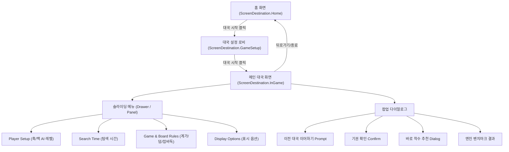

# Go AI Coach - 앱 IA (Information Architecture) & UI/UX 기능 명세서

본 문서는 **Go AI Coach** 앱의 화면 구조(IA), 화면별 UI 컴포넌트, 사용자 상호작용 피드백, 디자인 시스템 규칙을 정리한 통합 명세서입니다. UI/UX 디자이너, 모바일 개발자, 기획자가 앱의 전체 흐름과 세부 UX 사양을 한눈에 파악하고 협업할 수 있도록 구성되었습니다.

---

## 1. 앱 정보 구조 (IA - Information Architecture)

앱은 단순하고 직관적인 **3단계 스크린 구조**와 상황별 팝업/다이얼로그로 이루어져 있습니다.

---

## 2. 화면별 UI/UX 상세 명세

### 2.1. 홈 화면 (`GoCoachHomeScreen`)
- **목적**: 앱의 브랜드 첫인상을 전달하며 대국 진입 유도.
- **핵심 UI 요소**:
  - 브랜드 타이틀 및 바둑 AI 코치 컨셉 비주얼 이미지.
  - `대국 시작 (Start Game)` 메인 CTA 버튼.
- **UX 피드백**: Pressable 기반 심리스 터치 반응.

### 2.2. 대국 설정 로비 (`GameSetupLobby`)
- **목적**: 대국 시작 전 모든 대국 조건(바둑판 크기, 계가 방식, 덤, 접바둑, 플레이어/AI 조합)을 한눈에 설정하고 실시간 프리뷰 확인.
- **핵심 UI 요소**:
  1. **50% 축소 실시간 보드 프리뷰 (`GoBoard`)**:
     - 바둑판 크기(9x9, 13x13, 19x19) 및 접바둑(Handicap 2~9점 화점 돌 배치) 선택 시 즉시 실시간 반영.
  2. **대국 설정 패널 (`ScoringAndBoardSettingsPanel`)**:
     - **바둑판 크기 (`Board size`)**: `9x9`, `13x13`, `19x19`
     - **계가 방식 (`Scoring Rule`)**: `Area (중국식)` / `Territory (한국·일본식)`
     - **덤 (`Komi`)**: `0.5집`, `6.5집`, `7.5집` (기본값: 6.5집)
     - **접바둑 (`Handicap`)**: `없음(0)` ~ `최대 5/9점` (- / + 버튼 및 드롭다운)
  3. **플레이어 설정 (`Player Setup`)**:
     - 흑/백 각각 `사람(플레이어)` 또는 `AI(빠른 초급/초급/중급/고급 N단계)` 선택.
  4. **대국 시작 버튼 (`Start Match`)**:
     - 선택한 옵션으로 새 대국 세션을 세팅하고 메인 대국 화면으로 진입.

### 2.3. 메인 대국 화면 (`GoCoachContent`)
- **목적**: 실제 바둑 대국 진행 및 실시간 AI 코칭(추천수, 형세 판단, 점수 그래프) 제공.
- **핵심 UI 요소**:
  1. **상단 통합 헤더**:
     - 뒤로가기(홈으로), 대국 타이틀, 햄버거 메뉴 버튼, 엔진 씽킹 애니메이션 인디케이터 (`Thinking . .. ...`).
  2. **접이식 점수/승률 그래프 (`Score / Win Rate Panel`)**:
     - 헤더 바로 아래 위치. 터치 시 그래프 펼침/접힘.
     - 흑/백 포획 수(Captures) 및 실시간 승률/점수 리드 텍스트 표시.
  3. **메인 바둑판 (`GoBoard`)**:
     - 터치 착수 피드백, 마지막 착수 링 표시.
     - **AI 추천수Overlay (`Top Moves`)**: 1순위(큰 원), 2~5순위(작은 원) + 손실집수(`-Loss`) 텍스트.
     - **형세 및 영향권Overlay (`Eval`)**: 반투명 형세 그라데이션 (Ownership Gradient) 오버레이.
  4. **하단 플레이 액션 바**:
     - `Pass (패스)`: 차례 넘기기 (양 측 연속 패스 시 종국 계가진입).
     - `Undo (무르기)`: 1턴 되돌리기 (AI 대국 시 사람+AI 2수 동시 되돌리기).
     - `Top Moves (추천수 토글)`: 현재 국면 AI 상위 5개 추천수 표시/숨김.
     - `Eval (형세 판단 토글)`: 사석/영역 및 승률 오버레이 토글.
  5. **슬라이딩 메뉴 (Drawer / Panel)**:
     - `Player Setup`, `Search Time`, `Game (계가/덤/접바둑)`, `Display menu` 설정 실시간 변경 가능.

---

## 3. 다국어 용어 표준 표기 (i18n UI Matrix)

UI/UX 디자이너 및 작성자가 4개 국어 번역 시 준수해야 하는 다국어 기준표입니다:

| 기능 / 용어 | 한국어 (Ko) | 영어 (En) | 일어 (Ja) | 중국어 (Zh-CN) |
| :--- | :--- | :--- | :--- | :--- |
| **덤** | 덤 | Komi | 込み | 贴目 |
| **접바둑** | 접바둑 | Handicap | 置き石 | 贴子/譲子 |
| **계가 방식** | 계가 방식 | Scoring rule | 집계산 방식 | 贴目/数目规则 |
| **집 계가** | 집 계가 (Territory) | Territory | 地 (Territory) | 目数 (Territory) |
| **영역 계가** | 영역 계가 (Area) | Area | 領域 (Area) | 子数 (Area) |
| **무르기** | 무르기 | Undo | 待った | 悔棋 |
| **패스** | 패스 | Pass | パス | 停着/Pass |
| **추천수** | 추천수 | Top Moves | 候補手 | 推荐着手 |
| **형세 판단** | 형세 판단 | Eval | 💡 形勢 | 💡 局势 |

---

## 4. 착수 피드백 & 시각적 디자인 시스템

### 4.1. Point Loss 기반 색상 시스템
AI 코칭 피드백은 절대적 우세 여부가 아니라 **현재 국면 최선수 대비 점수 손실(Point Loss)**에 따라 색상을 지정합니다:

| 손실 구간 (Point Loss) | 색상 명칭 | 시각적 의미 |
| :--- | :--- | :--- |
| `0.0 ~ 0.5집` | **진한 초록 (Dark Green)** | 최선에 가까운 수 (Best Move) |
| `0.5 ~ 1.5집` | **연한 초록 (Light Green)** | 좋은 수 (Good Move) |
| `1.5 ~ 3.0집` | **노랑 (Yellow)** | 약간 아쉬운 수 (Inaccuracy) |
| `3.0 ~ 6.0집` | **주황 (Orange)** | 실수 (Mistake) |
| `6.0집 초과` | **빨강 (Red)** | 큰 손실 / 떡수 (Blunder) |

---

## 5. 향후 효율적 관리를 위한 추천 파일 목록 (제안)

다음 담당자가 UI/UX 및 기획을 계속 고도화할 때 추가로 관리하면 프로젝트 유지보수성이 크게 향상되는 추천 문서/자산 제안입니다:

1. **`docs/APP_IA_AND_UI_SPEC.md` (본 파일)**:
   - 앱의 화면 정보 구조(IA), 컴포넌트 기능 명세, 다국어 표기 가이드 통합 관리.
2. **`docs/UI_DESIGN_TOKENS.md` (추천 신규 제안)**:
   - Color Palette(Dark/Light), Typography Tokens(Inter/Roboto Font Sizes), Padding/Margin Tokens, Spacing Token을 명시하여 Figma - Compose 간 Design Token 일치 유지.
3. **`docs/SGF_AND_REVIEW_MODE_SPEC.md` (추천 신규 제안)**:
   - 로드맵 Phase 5 (KaTrain 스타일 복기 전용 UX & SGF 파일 가져오기/내보내기) 진행 시 필요한 상세 기획/UI 명세서.
4. **`docs/USER_ONBOARDING_GUIDE.md` (추천 신규 제안)**:
   - 초보 사용자가 앱을 처음 켰을 때 AI 코칭 기능(Top Moves, Eval, Win rate graph)을 이해할 수 있도록 안내하는 온보딩 튜토리얼 UX 기획서.
