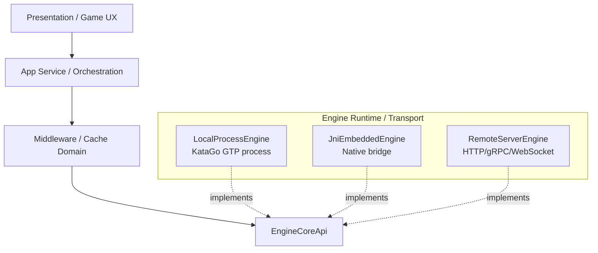

# 미래 아키텍처 비전

작성일: 2026-06-14

이 문서는 `go-ai-coach`가 Android-first local AI Go coaching app에서 출발해, 로컬 엔진, JNI, 원격 서버, 공식 캐시, 멀티플랫폼 UI를 모두 수용할 수 있는 구조로 성장하기 위한 장기 방향을 정리한다.

핵심 원칙은 **Local-first, Hybrid-ready**다. 기본 플레이 경험은 로컬 엔진으로 유지하되, 저사양 기기 보완, 정밀 분석, 공식 캐시 업데이트, 서버 기반 대국 같은 고도화는 같은 상위 API 뒤에서 선택적으로 붙인다.

## 비전과 비목표

### 비전

- 사용자는 로컬 엔진인지 원격 서버인지 의식하지 않고 같은 대국 UX를 사용한다.
- 엔진 원시 기능은 `EngineCoreApi`에 1:1로 보존하고, 미들웨어가 이를 조합해 대국/분석/캐시/계가 기능을 제공한다.
- 앱 UI는 엔진 transport, cache origin, model runtime 같은 하위 세부를 직접 알지 않는다.
- AI 에이전트와 인간 개발자가 UI, 대국 정책, 엔진 transport, 캐시 정책을 서로 다른 계층에서 안전하게 고도화할 수 있다.

### 현재 비목표

- 지금 당장 서버 엔진이나 MSA를 구현하지 않는다.
- 로컬 엔진을 제거하지 않는다. 오프라인 플레이와 빠른 로컬 응수는 제품의 기본 가치다.
- `EngineCoreApi`에 AI 캐릭터, UI 표시 색상, 캐시 origin, prompt 정책을 넣지 않는다.
- 거대한 rename이나 디렉터리 이동만으로 구조가 좋아졌다고 판단하지 않는다. 테스트 가능한 경계부터 단계적으로 옮긴다.

## 목표 계층

현재 장기 목표 계층은 `DOMAIN_SEPARATION_REFACTORING_PLAN.md`의 7계층을 따른다.

```text
Presentation / Game UX
  -> App Service / Session Orchestration
  -> Game Domain
  -> Middleware / Cache Domain
  -> Core Rules Domain
  -> Engine Core API
  -> Engine Runtime / Transport
```

역할은 다음처럼 구분한다.

| 계층 | 핵심 책임 |
| --- | --- |
| Presentation / Game UX | Compose rendering, 메뉴, 팝업, 보드 drawing, UI event 전달 |
| App Service / Session Orchestration | 새 게임, 복원, 무르기, 자동 AI, 종국, benchmark, 저장/로그 조율 |
| Game Domain | 심판, 턴 진행, 흑/백 seat, AI 캐릭터, 레벨링, 자동대국 정책 |
| Middleware / Cache Domain | `EngineCoreApi` 조합, position analysis, score sync, cache read/write, local/remote routing |
| Core Rules Domain | 바둑판, 합법수, 포획, 사석, 계가, fingerprint, 순수 KMP 모델 |
| Engine Core API | 엔진 원시 기능 1:1 계약 |
| Engine Runtime / Transport | local process, JNI, remote server, asset/config/model 실행 세부 |

## Engine Core API와 드라이버 관계

`EngineCoreApi`는 드라이버 레지스트리 자체가 아니라, 모든 엔진 runtime이 구현해야 하는 **원시 엔진 기능 계약**이다.



상위 계층은 concrete driver를 직접 보지 않는다. 로컬 프로세스, JNI, 원격 서버는 모두 `EngineCoreApi`를 구현하고, 앱은 `EngineSessionClient` 같은 미들웨어 API를 통해 조합된 기능을 사용한다.

이 구조가 필요한 이유:

- local process에서 remote server로 바꿔도 UI/대국 정책 변경을 최소화한다.
- 엔진 기능이 추가되면 먼저 core API로 노출하고, 미들웨어에서 조합한다.
- 서버 엔진 도입 전에도 local engine boundary와 테스트를 먼저 안정화할 수 있다.

## Hybrid-first 서버 전략

원격 서버는 기본값이 아니라 선택적 확장이다.

### 서버가 유리한 영역

- 저사양 기기에서 정밀 분석을 실행할 때
- 긴 시간의 주심 분석, 복기 분석, 대량 후보 평가가 필요할 때
- 공식 cache bundle 또는 운영자 검증 cache를 배포할 때
- 모델 업데이트를 빠르게 적용해야 할 때
- 원격 유저 대국 또는 계정 기반 학습 이력이 필요할 때

### 서버 도입 리스크

- 네트워크 지연과 오프라인 불가
- GPU/CPU 서버 비용
- 인증, abuse control, rate limit
- 사용자 대국 데이터와 개인정보 처리
- model version, ruleset, komi, cache schema mismatch
- 서버 장애 시 graceful fallback 필요

따라서 장기 전략은 다음과 같다.

| 상황 | 기본 선택 |
| --- | --- |
| 일반 9x9 대국 | 로컬 엔진 |
| 느린 기기에서 가벼운 대국 | 로컬 빠른 모드 + 공식 cache |
| 정밀 복기/주심 분석 | 사용자 요청 기반 원격 또는 별도 local worker |
| 공식 opening/cache 제공 | bundled cache + 원격 업데이트 |
| 네트워크 장애 | 로컬 엔진/로컬 cache fallback |

## 캐시와 프로토콜 계약

공식 캐시와 사용자 로컬 캐시는 앞으로 중요한 성능 계층이 된다. 캐시 key와 품질 정보는 엔진 transport보다 상위인 Middleware / Cache Domain에서 관리한다.

캐시 key에는 최소 다음 요소가 필요하다.

- board size
- ruleset
- komi
- 수순 또는 board fingerprint
- next player
- engine family
- model version
- search mode
- visits
- time cap 또는 uncapped 여부
- candidate count
- includePolicy/refinePolicyMoves 같은 분석 옵션

캐시 value에는 최소 다음 요소가 필요하다.

- 후보수 목록과 engine order
- point loss / score lead / win rate
- root visits와 fill status
- createdAt
- origin: `bundled-trusted`, `operator-trusted`, `peer-shared`, `local-user`
- 품질 등급: complete, partial, diagnostic

캐시 정책 원칙:

- 앱 기본 제공 캐시는 `bundled-trusted`로 시작한다.
- 운영자가 배포하는 최신 cache는 `operator-trusted`로 분리한다.
- 사용자 플레이 중 얻은 값은 `local-user`로 저장하되, root visits와 fill status를 반드시 보존한다.
- 원격 사용자 간 공유 cache는 장기 과제이며, 검증과 privacy 정책이 준비되기 전까지 기본 경로에 넣지 않는다.
- 초기 제품 정책은 정확성 우선을 위해 `exact-hit`을 신뢰 경로로 둔다. 즉 board/ruleset/komi/model/search mode/analysis options/visits/time cap이 모두 맞는 cache만 자동 의사결정에 사용한다.
- 다만 key가 너무 촘촘하면 미세한 visits/time cap 차이만으로 쌓아 둔 cache를 재사용하지 못한다. 장기적으로는 `rootVisits >= requiredVisits`, 동일 model/ruleset/komi/search mode, 호환 가능한 candidate 옵션을 만족하는 `compatible-hit` 정책을 도입한다.
- `compatible-hit`은 `exact-hit`보다 낮은 신뢰 등급으로 취급한다. AI 자동 착수, Top Moves 표시, 착수 리뷰, 운영자 cache 배포 중 어디까지 허용할지는 Middleware / Cache Domain의 정책과 테스트로 분리한다.

## 종국 판정과 장시간 분석

종국 판정은 일반 착수 분석과 다른 SLA를 가진다. `Search Time = OFF` 상태에서도 기본 pass/pass UX는 무제한으로 기다리지 않는다.

현재 장기 정책:

- 기본 종국: 5초 SLA의 부심 판정
- 주심 분석: 사용자가 명시적으로 `이의 제기: 주심 분석 요구`를 누를 때만 실행
- 주심 분석은 가능하면 별도 engine worker/process 또는 원격 서버로 분리
- 새 게임, 무르기, ruleset 변경, 앱 종료 시 주심 결과는 취소하거나 폐기
- 부심/주심 결과가 크게 다르면 `critical` diagnostic event로 기록
- 부심 결과로 이미 대국 종료 화면을 보여준 뒤 주심 결과가 크게 다르게 나오더라도 앱은 조용히 최종 결과를 덮어쓰지 않는다. 빠른 계가와 정밀 계가를 모두 보존하고, 사용자에게 차이와 신뢰도를 설명한 뒤 최종 채택 여부를 선택하게 한다.

이 정책은 local process뿐 아니라 remote server에서도 동일하게 유지한다. remote server가 생겨도 사용자가 원하지 않는 장시간 분석을 몰래 실행하지 않는다.

## AI 에이전트 친화 구조

AI 에이전트가 안전하게 코드를 고도화하려면 변경 단위가 작고 테스트 가능해야 한다.

### 포트와 어댑터

- Core Rules와 Game Domain은 Android SDK, Compose, 파일 시스템, Firebase를 직접 알지 않는다.
- Engine Runtime은 상위 UX 정책을 알지 않는다.
- Persistence, diagnostic, engine transport는 port/interface 뒤에 둔다.

### 단방향 데이터 흐름

- UI는 `GameScreenState`, `PlayerSetupUiState` 같은 DTO를 렌더링한다.
- UI action은 `GameUiEvent`로 전달한다.
- 상태 전이와 effect plan은 App Service / Controller 계층에서 계산한다.
- Compose는 가능하면 effect 실행과 rendering에 집중한다.

### 정책 컴포넌트

다음 정책은 작은 객체와 테스트로 유지한다.

- AI 후보 선택: `AiMoveSelectionPolicy`
- 종국 판정 선택: `EndgameScoreSelector`
- Top Moves launch/restore/cache hit 판정
- Search Time/visit budget 변환
- Prompt priority
- Auto AI delay/cancel policy

목표는 “AI 에이전트가 `GoCoachApp.kt` 전체를 읽지 않아도 특정 정책을 수정할 수 있는 구조”다. 단, native engine, Android lifecycle, process stream 문제는 순수 단위 테스트만으로 완전히 검증할 수 없으므로 실기기 로그와 `run-as` benchmark를 함께 사용한다.

## Remote Engine 도입 게이트

원격 엔진 구현은 아래 조건이 충족된 뒤 착수한다.

1. `GameSessionController` 또는 동등한 app service 경계가 UI coroutine orchestration 대부분을 흡수한다.
2. `EngineSessionClient`가 local/remote backend capability를 명확히 표현한다.
3. 분석 요청/응답 DTO가 local process와 remote server에서 동일하게 쓰일 수 있다.
4. cache key와 model versioning 정책이 고정된다.
5. timeout/cancel/new-game generation 폐기 정책이 테스트로 고정된다.
6. 로컬 fallback과 offline mode가 유지된다.

## 로드맵

### Phase 1: Controller / Effect 분리

- `GameSessionControllerState`를 실제 `GoCoachApp.kt` wiring에 점진 도입한다.
- 자동 AI, Top Moves, score estimate, benchmark, 종국 처리 effect를 명시 타입으로 분리한다.
- prompt priority와 saved session state를 App Service 계층으로 내린다.

### Phase 2: Engine Session 경계 강화

- local/remote 공통 `EngineSessionClient` DTO를 정리한다.
- `EngineCoreApi` raw primitive와 미들웨어 조합 API의 역할을 더 엄격히 분리한다.
- endgame assistant/chief judge policy를 코드로 구현한다.

### Phase 3: 공식 캐시 공급 체계

- bundled cache loader를 추가한다.
- operator-trusted cache update 경로를 설계한다.
- local-user cache와 공식 cache의 replacement/TTL/품질 정책을 테스트로 고정한다.

### Phase 4: Remote Engine Spike

- read-only position analysis부터 원격 호출을 실험한다.
- local fallback과 timeout/cancel/generation 폐기 정책을 검증한다.
- latency, 비용, privacy 리스크를 실제 데이터로 평가한다.

### Phase 5: 멀티플랫폼 확장

- shared/core rules와 middleware DTO를 KMP 친화적으로 유지한다.
- Android UI 의존이 섞인 application code를 점진적으로 분리한다.
- iOS/WASM은 실제 제품 요구가 생긴 뒤 spike로 검증한다.

## 한줄 결론

지금 당장 필요한 것은 서버 구현이 아니라, 서버가 오더라도 UI와 게임 도메인이 흔들리지 않는 계층 경계다. 로컬 플레이 품질을 유지하면서, 정밀 분석과 공식 캐시는 선택적으로 확장 가능한 하이브리드 구조를 목표로 한다.
