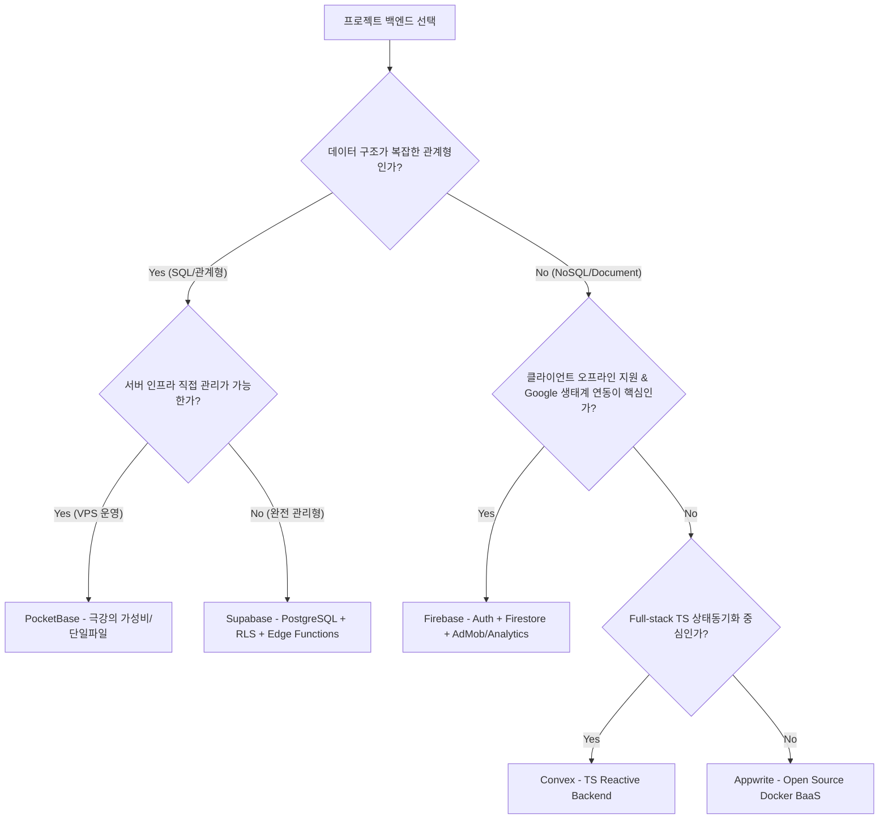

# [기술 문서] 1인 개발·MVP·PoC를 위한 BaaS(Backend-as-a-Service) 솔루션 비교 분석

## 1. 개요 (Overview)

1인 개발자 및 소규모 팀이 최소 기능 제품(MVP)이나 PoC(Proof of Concept)를 개발할 때 가장 가치 있는 자원은 **'시간'**과 **'운영 오버헤드의 최소화'**입니다. 최근 백엔드 시장은 서버 구성 및 인프라 관리 부담을 덜어주는 다양한 BaaS(Backend-as-a-Service) 솔루션이 활발히 경쟁하고 있습니다.

본 문서는 **Firebase, Supabase, PocketBase, Appwrite, Convex** 등 대표적인 5개 솔루션을 아키텍처, 데이터 모델, 보안/권한 제어, 오프라인 지원, 비용 구조, 벤더 락인 관점에서 기술적으로 깊이 있게 비교·분석합니다.

---

## 2. 핵심 비교 요약 (Comparison Matrix)

| 비교 항목 | **Firebase** | **Supabase** | **PocketBase** | **Appwrite** | **Convex** |
| :--- | :--- | :--- | :--- | :--- | :--- |
| **데이터베이스 유형** | Document NoSQL (Firestore) | Relational SQL (PostgreSQL) | Embedded Relational (SQLite) | Document NoSQL (MariaDB 기반) | Reactive Document (Custom Engine) |
| **주요 호스팅 방식** | Managed Serverless (GCP) | Cloud Managed / Self-Host | Single Binary (VPS Self-Host) | Cloud Managed / Self-Host (Docker) | Managed Serverless Cloud |
| **인증 (Auth)** | Auth SDK + Custom Claims | GoTrue + PostgreSQL RLS | Built-in Admin/User Auth | Built-in Auth + Teams/Roles | Custom Auth / Clerk & Auth0 연동 |
| **서버리스 펑션** | Cloud Functions (Node/Python) | Edge Functions (Deno/TS) | Go Code Extension / Hooks | Appwrite Functions (Multi-lang) | Native TS/JS Mutation & Query |
| **오프라인 지속성** | **완벽 지원 (SDK 내장)** | 미지원 (클라이언트 직접 구현) | 미지원 | 부분 지원 | 미지원 (인메모리 캐싱 지원) |
| **과금 모델** | Read/Write/Ops 종량제 | DB Storage + Egress 고정/종량제 | VPS 서버 비용 (고정 월 $4~$5) | 프로젝트/사용량 기준 고정+종량제 | Execution / Bandwidth 종량제 |
| **벤더 락인 (Lock-in)** | 높음 (GCP 종속) | 매우 낮음 (PostgreSQL 호환) | 없음 (오픈소스 SQLite) | 낮음 (오픈소스 Docker) | 중간 (TypeScript 스키마/엔진 종속) |
| **실시간 동기화** | Snapshot Listener (강력) | Realtime Pub/Sub (WAL 기반) | SSE (Server-Sent Events) | WebSockets (Realtime API) | Reactive Subscription (자동 반영) |

---

## 3. 솔루션별 심층 기술 분석

### 3.1. Google Firebase
* **아키텍처 & DB Engine**: GCP 기반의 완전 관리형 서버리스 아키텍처. Document 기반 NoSQL인 Firestore 및 Realtime Database 제공.
* **보안 & 권한 제어**: `request.auth` 객체를 이용한 **Firestore Security Rules** 기반 선언적 권한 제어. Token Custom Claims를 이용한 RBAC(역할 기반 접근 제어) 구현.
* **기술적 장점**:
  * **SDK 수준의 Offline Persistence**: 네트워크 끊김 시 로컬 IndexedDB/SQLite에 큐잉 후 자동 재동기화 (모바일/웹 공통 강력).
  * **Google 생태계 매끄러운 연동**: AdMob, Google Analytics, Remote Config, Cloud Messaging(FCM)과의 데이터/이벤트 시너지 극대화.
  * **Zero Infrastructure Overhead**: 인프라 프로비저닝이나 DB 인덱스 스케일링 신경 필요 없음.
* **기술적 단점 & 고려사항**:
  * **NoSQL Query 한계**: 복잡한 Join, Group By, Subquery 불가. 데이터 중복 저장(Denormalization) 설계 강제됨.
  * **비용 예측 불확실성**: 데이터 양이 아닌 **Read/Write/Delete 횟수당 과금**. 클라이언트 무한 루프 버그나 악성 요청 시 요금 폭탄 위험 존재 (`App Check` 필수).

### 3.2. Supabase
* **아키텍처 & DB Engine**: **PostgreSQL**을 핵심으로 한 오픈소스 Firebase 대안. PostgREST, GoTrue, Realtime engine 통합.
* **보안 & 권한 제어**: PostgreSQL의 표준 기능인 **RLS (Row Level Security)** 정책 적용. SQL 문법으로 테이블/행 단위 미세 접근 제어.
* **기술적 장점**:
  * **완벽한 Relational DB (SQL)**: 복잡한 데이터 관계(1:N, N:M), 트랜잭션, Foreign Key constraints, 정교한 SQL 집계 쿼리 완벽 지원.
  * **Deno 기반 Edge Functions**: Cold Start가 거의 없는 글로벌 Edge 단 런타임 제공. TypeScript Native 및 URL 기반 npm/Deno 모듈 호출.
  * **예측 가능한 비용**: Pro 플랜($25/월) 중심의 용량/트래픽 기준과금으로 데이터 요청 횟수 폭증에 따른 요금 리스크 최소화.
* **기술적 단점 & 고려사항**:
  * **오프라인 지원 부재**: 기본 SDK에 오프라인 캐싱 및 충돌 해결 기능이 없어 React Query/WatermelonDB 등을 조합해야 함.
  * **SQL & RLS 학습 곡선**: DB 스키마 설계 및 SQL 기반 RLS 정책 작성 숙련도 요구.

### 3.3. PocketBase
* **아키텍처 & DB Engine**: **Single Go Executable File + Embedded SQLite**. 단 하나의 파일로 실행되는 극강의 경량 BaaS.
* **보안 & 권한 제어**: PocketBase Admin UI에서 쿼리 기반 API Rules(`@request.auth.id != ""`) 설정.
* **기술적 장점**:
  * **극단적인 가성비 및 단순성**: $4~$5/월 수준의 저가형 Linux VPS(Hetzner, DigitalOcean) 하나에서 DB, Auth, Storage, Admin UI가 완벽 구동.
  * **Go/JS 훅을 통한 커스텀 백엔드**: Go 모듈로 컴파일하거나 작성한 JS 커스텀 스크립트를 서버 훅(Hook)으로 실행 가능.
* **기술적 단점 & 고려사항**:
  * **수평 확장(Scale-out) 불가**: 단일 서버 SQLite 기반이므로 분산 스케일링이 어려움 (Scale-up 위주).
  * **클라우드 부가 기능 부재**: 관리형 서버리스 펑션, 글로벌 CDN 스토리지 등을 직접 구축/관리해야 함.

### 3.4. Appwrite
* **아키텍처 & DB Engine**: Docker 컨테이너 기반으로 동작하는 오픈소스 BaaS. 내부적으로 MariaDB/Redis/InfluxDB 등 활용.
* **보안 & 권한 제어**: Document 및 Collection 레벨에서 사용자, 팀(Team), 역할(Role) 단위의 직관적인 Permission 설정.
* **기술적 장점**:
  * **Firebase 스타일의 직관적 UI/UX**: REST/GraphQL 및 WebSockets를 통한 다채로운 SDK 지원.
  * **다양한 런타임 Functions**: Node.js, Python, Ruby, PHP, Go, Dart 등 폭넓은 언어의 Cloud Functions 지원.
* **기술적 단점 & 고려사항**:
  * **PostgreSQL 대비 SQL 생태계 부족**: Relational SQL 쿼리 생태계보다는 Document 기반 접근법에 가까움.

### 3.5. Convex
* **아키텍처 & DB Engine**: 클라이언트 상태 관리와 백엔드를 하나로 묶은 **Reactive Document Database**.
* **보안 & 권한 제어**: TypeScript 백엔드 로직 내부에서 사용자 Context를 검증하는 Code-first Security.
* **기술적 장점**:
  * **TypeScript 완벽 통합**: 클라이언트-백엔드 간 End-to-End Type Safety 제공. API 스키마 정의 없이 백엔드 함수가 즉시 클라이언트 상태로 바인딩.
  * **자동 반응형(Reactive)**: 쿼리가 데이터 변경 시 클라이언트 UI를 자동으로 업데이트 (별도 수동 구독 코드 최소화).
* **기술적 단점 & 고려사항**:
  * **신생 플랫폼 & 커뮤니티 사이즈**: 상대적으로 좁은 생태계, 제3자 서비스 및 타사 라이브러리 연동 수동 처리 필요.

---

## 4. 백엔드 선택 의사결정 트리 (Decision Tree)

---

## 5. 결론 및 1인 개발자를 위한 제언

* **Firebase**: **Google SDK/AdMob/Analytics 연동 중심의 앱**, 오프라인 작업이 많고, 빠른 시장 검증이 최우선인 MVP에 최적.
* **Supabase**: **결제, 커머스, complex RDBMS 데이터 관계**가 존재하고, 향후 데이터 이전(오픈소스) 및 비용 안전성을 확보하려는 프로젝트에 최적.
* **PocketBase**: **초저예산(월 $5 이하)**으로 다수의 초경량 서비스나 개인 사이드 프로젝트를 고성능으로 운용하고자 할 때 최적.
