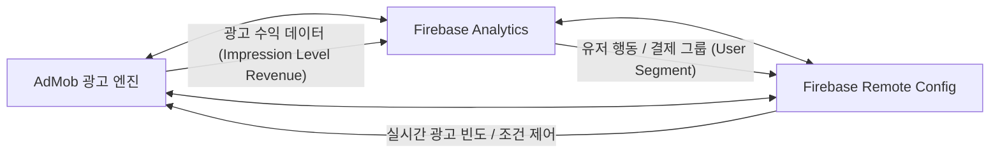
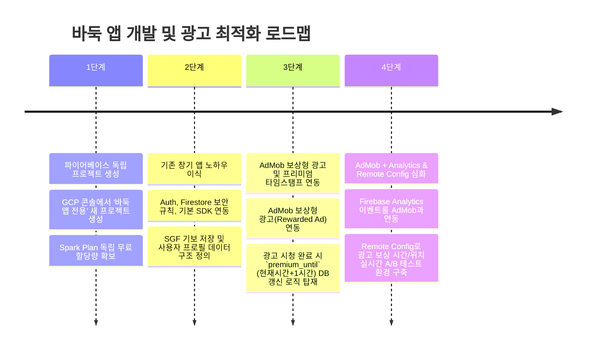

# [기술 가이드] 개발자 배경 기반 신규 바둑 앱 백엔드 & AdMob 시너지 전략 추천

## 1. 배경 및 핵심 과제 분석

### 1.1. 개발자 배경 및 자산
* **기존 경험**: 이미 구글 파이어베이스(Firebase Auth, Firestore/Storage) 및 AdMob을 연동하여 장기(Janggi) 앱을 성공적으로 출시·운영 중.
* **핵심 강점**: Firebase 보안 규칙, 클라이언트 SDK 연동, 앱 생태계에 대한 숙련도 보유.

### 1.2. 신규 바둑 앱 핵심 비즈니스 요구사항
1. **기보(SGF) 및 대국 데이터 저장**: 기보 텍스트 및 유저 대국 기록 관리.
2. **아이템 단품 결제**: 복기권, AI 힌트권 등 단품 아이템 결제 처리 및 영수증 검증.
3. **보상형 광고(Rewarded Ad) 기반 한시적 프리미엄 개방**: 광고 1회 시청 시 일정 시간(예: 1시간) 동안 프리미엄 기능(AI 복기/분석) 활성화.
4. **광고 수익화 최적화 심화**: AdMob 연동 및 데이터 분석/실험을 통한 수익 극대화.

---

## 2. Firebase 프로젝트 인프라 및 요금 구조 분석

### 2.1. Spark Plan(무료 티어) 프로젝트 독립성 메커니즘
많은 개발자가 오해하는 부분 중 하나는 계정(Google Account) 단위로 무료 사용량이 제한된다는 점입니다. 그러나 **Firebase의 무료 할당량(Spark Plan)은 구글 계정이 아닌 '프로젝트(Project)' 단위로 각각 독립 적용**됩니다.

```
[구글 계정 (Google Account)]
 ├── [프로젝트 1: 장기 앱] ---> Spark Plan 무료 할당량 (독립 적용)
 └── [프로젝트 2: 바둑 앱] ---> Spark Plan 무료 할당량 (독립 적용, 100% 리셋된 신규 할당량)
```

> [!IMPORTANT]
> **프로젝트 분리 필수 규칙**:
> * **권장 구조**: 파이어베이스 콘솔에서 `[새 프로젝트 생성]`을 눌러 바둑 앱 전용 독립 프로젝트를 생성합니다. 장기 앱의 데이터 트래픽이 바둑 앱의 무료 범위(하루 Firestore 읽기 5만 회, 쓰기 2만 회 등)에 **0.1%도 영향을 주지 않습니다.**
> * **주의 구조 (금지)**: 기존 '장기 앱 프로젝트' 내부에 앱 추가(Android/iOS) 형태로 바둑 앱을 묶는 경우 두 앱이 무료 사용량을 공유하여 유료 전환이 급격히 빨라집니다.

---

## 3. AdMob + Firebase 삼각 데이터 시너지 심화

Supabase 등 타 BaaS를 사용하더라도 AdMob 광고를 띄우는 것은 기술적으로 문제없이 작동합니다. 하지만 **Firebase + AdMob 연동 시에만 제공되는 3가지 강력한 데이터 분석 및 수익화 시너지**는 1인 개발자의 운영 부담을 획기적으로 줄여줍니다.



### 3.1. 자동 ROI & 유저 단위 LTV/ARPU 추적
* **통합 LTV(Lifetime Value) 산출**: 기존에는 "인앱 결제 수익"만 유저별로 추적 가능했으나, Firebase Analytics와 AdMob을 연동하면 **"광고 노출을 통해 발생한 수익(tROAS/Impression Revenue)"까지 유저 단위로 자동 합산**됩니다.
* **유입 채널별 수익성 비교**: 구글 래퍼럴, 페이스북 광고, 유기적 유입 유저 중 "어떤 채널 유저가 광고를 더 많이 보고 장기 체류하는지" 정확한 마케팅 ROI 측정이 가능합니다.

### 3.2. 유저 세그먼트(Segment) 기반 맞춤형 광고 노출
* **결제 유저 보호 (VIP 처리)**: 아이템 단품 결제 이력이 있는 "유료 유저"에게는 전면 광고나 이면 광고를 자동으로 숨기고, "무과금 유저"에게만 보상형/전면 광고를 노출하는 로직을 코드 변경 최소화로 구현할 수 있습니다.
* **이탈 위험 유저 케어**: 앱 접속 빈도가 줄어드는 유저 세그먼트를 추출하여 보상형 광고 혜택을 일시적으로 늘려 재방문을 유도할 수 있습니다.

### 3.3. Remote Config를 활용한 광고 정책 A/B 테스트 (핵심)
스토어 심사 및 앱 업데이트 없이 Firebase 콘솔에서 실시간으로 광고 정책을 실험하고 최적화할 수 있습니다.

* **실험 예시 (보상형 광고 혜택 실험)**:
  * **Group A (50%)**: 광고 1회 시청 시 `30분` 프리미엄 부여.
  * **Group B (50%)**: 광고 1회 시청 시 `60분` 프리미엄 부여.
* **분석 결과 산출**: 혜택 시간이 길어질 때 이탈률(Churn Rate) 감소와 광고 재시청 횟수 증가 중 어떤 쪽이 최종 광고 매출(eCPM)을 극대화하는지 파이어베이스 A/B Test Dashboard에서 통계적 유의성과 함께 한눈에 확인 가능합니다.

---

## 4. 바둑 앱 핵심 기능 데이터 아키텍처 설계

### 4.1. 기보(SGF) 및 대국 기록 (Firestore NoSQL 구조)
바둑 기보(SGF: Smart Game Format)는 수많은 수 순과 좌표가 텍스트 코드로 구성되어 있습니다. 이를 RDBMS 테이블로 쪼개기보다 Firestore Document 내 단일 필드(JSON/String)로 다루는 것이 읽기/쓰기 성능과 비용 면에서 훨씬 유리합니다.

```json
// collections: matches/{matchId}
{
  "match_id": "baduk_20260729_001",
  "black_player": "uid_user_123",
  "white_player": "uid_ai_bot",
  "result": "B+Resign",
  "sgf_data": "(;GM[1]FF[4]CA[UTF-8]AP[GoCoach]SZ[19]KM[6.5]...)",
  "created_at": "2026-07-29T11:30:00Z"
}
```

### 4.2. 보상형 광고 기반 "한시적 프리미엄" 구현 가이드

```
[클라이언트]                     [AdMob SDK]               [Firestore DB]
    |                                 |                          |
    |-- 1. 보상형 광고 시청 요청 ---> |                          |
    |                                 |                          |
    |<-- 2. OnUserEarnedReward 이벤트 -|                          |
    |                                                            |
    |-- 3. Firestore 타임스탬프 갱신 요청 (premium_until = Now + 1 hr) ->|
    |                                                            |
    |<-- 4. DB 갱신 완료 ----------------------------------------|
    |
    |-- 5. 프리미엄 기능(AI 복기) 접근 시 (Now < premium_until) 검증
```

#### Firestore Security Rules 보안 규칙 예시
```javascript
rules_version = '2';
service cloud.firestore {
  match /databases/{database}/documents {
    // 유저 프로필 및 한시적 프리미엄 권한 검증
    match /users/{userId} {
      allow read: if request.auth != null && request.auth.uid == userId;
      // 클라이언트 갱신 시 타임스탬프 검증 (또는 Cloud Functions 처리)
      allow update: if request.auth != null && request.auth.uid == userId
                    && request.resource.data.premium_until is timestamp;
    }
    
    // AI 복기 요청 API 보안 규칙
    match /ai_analysis_requests/{requestId} {
      allow create: if request.auth != null 
                    && get(/databases/$(database)/documents/users/$(request.auth.uid)).data.premium_until > request.time;
    }
  }
}
```

---

## 5. 솔루션 비교 및 최종 전략 평가

| 평가 기준 | **Option A: Firebase + AdMob (최종 추천)** | **Option B: Supabase + AdMob (독립)** |
| :--- | :--- | :--- |
| **개발 생산성 (1인 개발)** | **극상** (장기 앱 코드 및 노하우 100% 이식) | **보통** (SQL 스키마 design & RLS 새 학습 필요) |
| **보상형 광고 & A/B 테스트** | **압도적** (Remote Config + Analytics 기본 통합) | **추가 구축 필요** (별도 Analytics SDK 연동 필요) |
| **기보(SGF) 저장 적합성** | **우수** (Document 텍스트 통째 저장에 초점) | **우수** (JSONB 타입 지원) |
| **초기 구축 비용** | **0원** (독립 프로젝트 Spark Plan 제공) | **0원** (Free Tier 제공) |
| **유저 간 복잡한 관계형 쿼리** | 보통 (기본 쿼리 중심) | **극상** (PostgreSQL SQL 활용) |

---

## 6. 최종 전략 추천 및 실행 로드맵 (Actionable Roadmap)

### 💡 최종 추천 결론
**"신규 바둑 앱도 Firebase + AdMob 생태계로 구축하는 것을 강력 추천합니다."**

1인 개발자에게 가장 귀중한 자원은 **'개발 시간'**과 **'운영 효율성'**입니다. 바둑 앱은 기보 데이터(SGF) 저장이 중심이며 관계형 데이터 복잡도가 높지 않으므로 NoSQL(Firestore) 구조로 충분합니다. 

기존 장기 앱의 인증, DB 연동, AdMob 연동 코드를 재활용하여 백엔드 구축 시간을 90% 이상 단축하고, 절약된 시간으로 **AdMob Analytics + Remote Config A/B 테스트를 활용한 광고 수익화 심화 학습 및 바둑 AI/UI 완성도 향상**에 집중하는 것이 가장 명확하고 효율적인 전략입니다.

---

### 🚀 단계별 실행 로드맵



1. **1단계: Firebase 독립 프로젝트 세팅**
   * GCP/Firebase 콘솔에서 장기 앱 프로젝트와 별개인 `baduk-app-prod` 신규 프로젝트 생성.
2. **2단계: 기존 인프라 및 Auth/Store 코드 이식**
   * 장기 앱에서 검증된 Auth, Firestore 초기화 패키지 이식.
   * `users/{userId}` 경로에 `premium_until: Timestamp` 필드 설계.
3. **3단계: AdMob 보상형 광고 & 프리미엄 연동**
   * AdMob 콘솔에 바둑 앱 등록 후 Firebase 프로젝트와 바인딩.
   * 보상형 광고 시청 완료 이벤트 수신 시 Firestore의 `premium_until`을 1시간 연장 업데이트.
4. **4단계: Remote Config & Analytics A/B 테스트 설정 (심화 학습)**
   * Remote Config에 `rewarded_premium_duration_minutes` 변수 생성 (기본값: 60).
   * 파이어베이스 A/B Test 메뉴에서 30분 vs 60분 보상에 대한 광고 시청률 및 LTV 영향 실험 구동.
