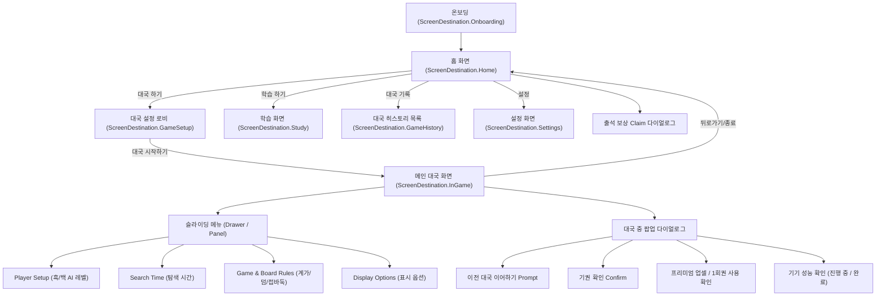

# Go AI Coach - 앱 IA (Information Architecture) & UI/UX 기능 명세서

본 문서는 **Go AI Coach** 앱의 화면 구조(IA), 화면별 UI 컴포넌트, 사용자 상호작용 피드백, 디자인 시스템 규칙을 정리한 통합 명세서입니다.

> **갱신: 2026-08-29** — 1절 IA와 2절 화면 명세를 현재 코드(`ScreenDestination`, `ui/GamePlaySection.kt`) 기준으로 정정했습니다. 이전 판은 화면 3개 + `Analyze` 버튼을 명세했지만 실제 목적지는 7개이고 `Analyze` 버튼은 제거된 상태였습니다. UI/UX 디자이너, 모바일 개발자, 기획자가 앱의 전체 흐름과 세부 UX 사양을 한눈에 파악하고 협업할 수 있도록 구성되었습니다.

---

## 1. 앱 정보 구조 (IA - Information Architecture)

앱은 단순하고 직관적인 **3단계 스크린 구조**와 상황별 팝업/다이얼로그로 이루어져 있습니다.

`ScreenDestination`(`ui/GoCoachApp.kt`)이 정의하는 목적지는 **7개**입니다 — `Onboarding`, `Home`, `Settings`, `Study`, `GameHistory`, `GameSetup`, `InGame`.

**2026-08-29 기준 이 절이 아직 상세 명세를 갖지 않은 화면**: `Onboarding`, `Settings`, `GameHistory`(참여/리텐션 트랙 백로그 #7로 신설), 그리고 앱 전역에 뜨는 출석 보상 Claim 다이얼로그(백로그 #14, `ui/AttendanceRewardClaimDialog.kt`). 해당 트랙의 스펙은 `260823-260830_OFFLINE_ENGAGEMENT_FEATURES_KICKOFF_PLAN.md`에 있습니다 — 트랙이 끝나면 여기로 흡수합니다.

---

## 2. 화면별 UI/UX 상세 명세

### 2.1. 홈 화면 (`GoCoachHomeScreen`)
- **목적**: 앱의 브랜드 첫인상을 전달하며 대국/학습 진입 유도.
- **핵심 UI 요소**:
  - 브랜드 타이틀 및 바둑 AI 코치 컨셉 비주얼 이미지.
  - `대국 하기 (Start Match)` 메인 CTA 카드 — 부제: "AI 혹은 로컬 플레이어와 대국을 설정하고 시작합니다." 클릭 시 대국 설정 로비로 이동.
  - `학습 하기 (Study)` 카드 — 부제: "기보 복기, 사활 퀴즈 등 바둑 실력을 고도화합니다." 현재 미구현 상태이며 클릭 시 "아직 준비 중인 기능입니다." 안내 토스트만 표시.
- **UX 피드백**: Pressable 기반 심리스 터치 반응.

### 2.2. 대국 설정 로비 (`GameSetupLobby`)
- **목적**: 대국 시작 전 모든 대국 조건(계가 방식, 덤, 바둑판 크기, 접바둑, 플레이어/AI 조합)을 한눈에 설정하고 실시간 프리뷰 확인.
- **핵심 UI 요소**:
  1. **50% 축소 실시간 보드 프리뷰 (`GoBoard`)**:
     - 바둑판 크기(9x9, 13x13, 19x19) 및 접바둑(Handicap, 보드 크기별 0~5 또는 0~9점 화점 배치) 선택 시 즉시 실시간 반영.
  2. **대국 설정 패널 (`ScoringAndBoardSettingsPanel`)** — 아래 순서로 배치:
     - **계가 방식 (`Scoring Rule`)**: `면적 계가 (영역+돌 계가)` (Area/중국식) / `집 계가 (영역+사석 계가)` (Territory/한국·일본식)
     - **덤 (`Komi`)**: `0.5집`, `6.5집`, `7.5집` (기본값: 6.5집)
     - **바둑판 크기 (`Board size`)**: `9x9`, `13x13`, `19x19`
     - **접바둑 (`Handicap`)**: `접바둑 없음`(기본값) ~ `접바둑 N점` (9x9·13x13은 최대 5점, 19x19는 최대 9점) — `[-] [드롭다운] [+]` 구성
  3. **플레이어 설정 (`Player Setup`)**:
     - 흑/백 각각 `사람(플레이어)` 또는 `AI` 선택. **AI 난이도는 2026-08-18부터 `빠른 초급` 5단계(`초보`/`하수`/`중수`/`고수`/`초고수`) 1뎁스로만 노출됩니다** — 기존 `초급`/`중급`/`고급` 그룹은 코드는 남아 있으나 UI에서 숨겨졌습니다(`ENGINE.md` 레벨 매핑 표 참고).
  4. **대국 시작하기 버튼 (`startMatchAction`)**:
     - 선택한 옵션으로 새 대국 세션을 세팅하고 메인 대국 화면으로 진입.

### 2.3. 메인 대국 화면 (`GoCoachContent`)
- **목적**: 실제 바둑 대국 진행 및 실시간 AI 코칭(추천 수, 형세 판단, 점수 그래프) 제공.
- **핵심 UI 요소**:
  1. **상단 통합 헤더**:
     - 뒤로가기(홈으로), 대국 타이틀, 햄버거 메뉴 버튼, 엔진 씽킹 애니메이션 인디케이터 (`Thinking . .. ...`).
  2. **접이식 점수/승률 그래프 (`Score / Win Rate Panel`)**:
     - 헤더 바로 아래 위치. 터치 시 그래프 펼침/접힘.
     - 흑/백 포획 수(Captures) 및 실시간 승률/점수 리드 텍스트 표시.
  3. **메인 바둑판 (`GoBoard`)**:
     - 터치 착수 피드백, 마지막 착수 링 표시.
     - **AI 추천 수 Overlay (`Top Moves`)**: 1순위(큰 원), 2~5순위(작은 원) + 손실집수(`-Loss`) 텍스트.
     - **형세 보기 Overlay (`Eval`)**: 사석/영역 표시 및 형세(집차)·승률 정보를 보여주는 반투명 오버레이.
  4. **하단 플레이 액션 바**:
     - `Pass (통과)`: 차례 넘기기 (양 측 연속 패스 시 종국 계가 진입).
     - `Undo (무르기)`: 1턴 되돌리기 (AI 대국 시 사람+AI 2수 동시 되돌리기).
     - `Top Moves (추천 수 토글)`: 현재 국면 AI 상위 5개 추천 수 표시/숨김.
     - `Eval (형세 보기 토글)`: 사석/영역 및 승률 오버레이 토글.
     - `Resign (기권)`: 대국 포기. "정말 기권하시겠습니까?" 확인 다이얼로그 후 처리.
     - ~~`Analyze (분석)`~~ — **제거됨**(2026-08-17 이전). 별도 분석 다이얼로그는 더 이상 없습니다.

     ⚠️ **위 액션들은 더 이상 전부 무조건 활성이 아닙니다.** `Undo`/`Top Moves`/`Eval`은 프리미엄·클레임·소모품 1회권으로 게이팅되며, 잠긴 상태에서 누르면 업셀 또는 1회권 사용 확인 팝업이 뜹니다(`ui/GamePlaySection.kt`, `ui/ConsumableUiState.kt`). 정책 원본은 `feature-access-principles/README.md`와 `launch-plan/README.md` 2장이며, 이 절은 아직 그 게이팅 상태별 UI를 상세히 명세하지 않았습니다.
  5. **슬라이딩 메뉴 (Drawer / Panel)**:
     - `Player Setup`, `Search Time`, `Game & Board Rules (계가/덤/접바둑)`, `Display Options (표시 옵션)` 설정 실시간 변경 가능.

---

## 3. 다국어 용어 표준 표기 (i18n UI Matrix)

UI/UX 디자이너 및 작성자가 4개 국어 번역 시 준수해야 하는 다국어 기준표입니다:

| 기능 / 용어 | 한국어 (Ko) | 영어 (En) | 일어 (Ja) | 중국어 (Zh-CN) |
| :--- | :--- | :--- | :--- | :--- |
| **덤** | 덤 | Komi | 込み | 贴目 |
| **접바둑** | 접바둑 | Handicap | 置き石 | 让子 |
| **계가 방식** | 계가 방식 | Scoring rule | 計算方式 | 数目规则 |
| **집 계가** | 집 계가 (영역+사석 계가)[^1] | Territory Scoring | 地合計算 | 数目计分 |
| **면적 계가** | 면적 계가 (영역+돌 계가) | Area Scoring | 面積計算 | 数子计分 |
| **무르기** | 무르기 | Undo | 待った | 悔棋 |
| **패스** | 통과 | Pass | パス | 停一手 |
| **추천 수** | 추천 수 | Top moves | 候補手 | 推荐手 |
| **형세 보기** | 형세 보기 | Eval | 形勢判断 | 形势判断 |

[^1]: 2026-07-28 세션에서 발견된 자기모순(Territory 규칙 괄호에 Area 규칙명 "영역 계가"가 잘못 붙어 있던 문제)을 같은 세션에서 `UiStrings.kt`에 직접 수정했습니다. 영역(territory)+사석(captures) 계산이라는 실제 정의에 맞춰 "영역+사석 계가"로 정정.

---

## 4. 착수 피드백 & 시각적 디자인 시스템

### 4.1. Point Loss 기반 색상 시스템
AI 코칭 피드백은 절대적 우세 여부가 아니라 **현재 국면 최선수 대비 점수 손실(Point Loss)**에 따라 색상을 지정합니다 (`MoveReview.kt`의 `MoveReviewTone` 기준, 실제 구현과 임계값·색상 일치 확인됨):

| 손실 구간 (Point Loss) | 색상 명칭 | 시각적 의미 |
| :--- | :--- | :--- |
| `0.0 ~ 0.5집` | **진한 초록 (Dark Green)** | 최선에 가까운 수 (Best Move / Excellent) |
| `0.5 ~ 1.5집` | **연한 초록 (Light Green)** | 좋은 수 (Good Move) |
| `1.5 ~ 3.0집` | **노랑 (Yellow)** | 약간 아쉬운 수 (Inaccuracy) |
| `3.0 ~ 6.0집` | **주황 (Orange)** | 실수 (Mistake) |
| `6.0집 초과` | **빨강 (Red)** | 큰 손실 / 떡수[^2] (Blunder) |
| 분석 정보 없음 | **회청색 (Blue-Gray)** | 분석 대기 중 또는 후보 외 착수 (Unknown) |

[^2]: "떡수"는 문서상 설명을 돕기 위한 표현이며 코드 내 리터럴 문자열로 존재하지는 않습니다 (코드 상 영문 라벨은 `Blunder`).

> AI 추천 수(Top Moves) 오버레이는 이 표의 절대 임계값과 별도로, 최선 후보의 손실이 이미 큰 국면에서는 상대적 손실 비율로 보정하는 로직(`topMoveDisplayToneFor`)을 씁니다. 이 표는 단일 착수 복기 마커(`moveReviewToneFor`)에 적용되는 절대 임계값 기준입니다.

---

## 5. 향후 효율적 관리를 위한 추천 파일 목록 (제안)

다음 담당자가 UI/UX 및 기획을 계속 고도화할 때 추가로 관리하면 프로젝트 유지보수성이 크게 향상되는 추천 문서/자산 제안입니다:

1. **`APP_IA_AND_UI_SPEC.md` (본 파일)**:
   - 앱의 화면 정보 구조(IA), 컴포넌트 기능 명세, 다국어 표기 가이드 통합 관리.
2. **`docs/spec/UI_DESIGN_TOKENS.md` (추천 신규 제안)**:
   - Color Palette(Dark/Light), Typography Tokens(Inter/Roboto Font Sizes), Padding/Margin Tokens, Spacing Token을 명시하여 Figma - Compose 간 Design Token 일치 유지.
3. **`docs/spec/SGF_AND_REVIEW_MODE_SPEC.md` (추천 신규 제안)**:
   - 로드맵 Phase 5 (KaTrain 스타일 복기 전용 UX & SGF 파일 가져오기/내보내기) 진행 시 필요한 상세 기획/UI 명세서.
4. **`docs/spec/USER_ONBOARDING_GUIDE.md` (추천 신규 제안)**:
   - 초보 사용자가 앱을 처음 켰을 때 AI 코칭 기능(Top Moves, Eval, Win rate graph)을 이해할 수 있도록 안내하는 온보딩 튜토리얼 UX 기획서.
