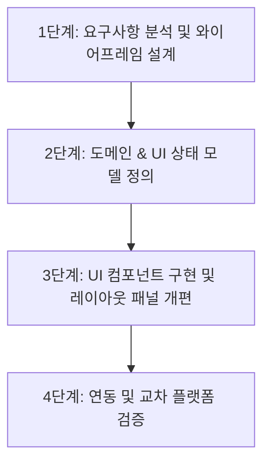

# UX 고도화 작업 요약 및 마스터 플랜

본 문서는 **go-ai-coach** 프로젝트의 사용자 경험(UX) 고도화를 위한 작업 요약 설명서 및 단계별 개발 플랜입니다. 사용자 중심의 직관적이고 미려한 대국 화면을 구축하고, 13x13 이상의 대형 바둑판에서도 안정적으로 착수할 수 있는 기능을 제공하는 것을 목표로 합니다.

---

## 1. 개요 및 목표

### 1.1. 배경 및 필요성
- **화면 활용도 극대화**: 모바일 디바이스의 다양한 화면 크기에 대응하여 바둑판 영역을 정사각형으로 꽉 차게 렌더링할 필요가 있습니다.
- **정보 전달성 개선**: 현재 대국의 진행 상황(차례, 사석 수, 시간 흐름 등)을 양 진영 관점에서 직관적으로 한눈에 볼 수 있는 정보 패널이 요구됩니다.
- **착수 실수 방지 (13x13 이상)**: 화면이 커질수록 터치 실수가 잦아집니다. "바로 착수" 온/오프 토글을 도입하여, 오프(Off) 시 흐릿한 돌로 위치를 사전 확인한 후 착수 버튼을 눌러 확정하는 2단계 착수 메커니즘을 지원합니다.

### 1.2. 주요 목표
1. **정사각형 바둑판 자동 스케일링**: Parent 뷰의 너비(W)와 높이(H) 중 좁은 영역을 기준으로 최대 크기의 정사각형 바둑판을 보드 크기에 관계없이 일관되게 렌더링.
2. **3분할 대국 현황 패널**: 
   - 좌측: 흑진영 정보(돌 색상 및 획득 사석 수)
   - 우측: 백진영 정보(돌 색상 및 획득 사석 수)
   - 중앙: [착수] 버튼 (착수 대기 상태 및 가상 착수 시 활성화)
3. **기능 버튼 패널 다국어(한/영) 및 배치 고도화**:
   - Pass(통과), Undo(무르기), Best(추천수), Eval(형세판단) 버튼의 UI/UX 설계 및 한/영 리소스 대응 준비.
4. **"바로 착수(Direct Play)" 옵션 메뉴 신설 및 연동**:
   - 메뉴 옵션을 통한 글로벌 착수 정책(On/Off) 관리.
   - Off 상태일 경우, 바둑판 터치 시 가상 착수 상태(흐릿한 돌 표시)로 진입하고, 대국 현황 패널의 [착수] 버튼을 통해 최종 확정.

---

## 2. 표현계층(Presentation Layer) 고도화 프로세스

전문적인 표현계층 설계 및 리팩토링을 위해 다음과 같은 **4단계 프로세스**를 적용합니다.

### [1단계] 요구사항 분석 및 와이어프레임 설계 (v1.0.0)
- 화면 레이아웃 분할 구조를 텍스트 및 아스키 와이어프레임으로 상세 설계합니다.
- `ux-improvement/wireframes/` 폴더를 생성하고 버전을 명시하여 UX 변경 이력을 관리합니다.

### [2단계] UI State 및 Domain State 확장 정의
- **바로 착수 모드(Direct Play Mode)**: UI State에 `isDirectPlayEnabled: Boolean` 추가.
- **가상 착수(Ghost Stone / Tentative Move)**: 바둑판 상에 아직 확정되지 않은 좌표(`tentativeMove: Point?`)를 상태로 관리.
- **사석 수(Captured Stones)**: 흑/백 진영이 각각 상대방 돌을 따낸 개수 정보를 UI에 반영. (기존 shared 모듈 및 game session에서 동기화 여부 확인 후 보완)

### [3단계] UI 컴포넌트 리팩토링 (Compose)
- **`GoBoard.kt`**: `BoxWithConstraints` 등을 사용하여 Parent Size에 부합하는 최대 정사각형 캔버스 크기를 동적으로 계산하고, 가상 착수(흐릿한 돌) 렌더링 로직 추가.
- **`GamePlaySection.kt`**: 대국 현황 패널과 기능 버튼 패널의 레이아웃을 전면 개편.
- **`GameMenuSection.kt`**: "바로 착수" 온/오프 스위치 추가.

### [4단계] 통합 및 플랫폼 검증
- Kotlin JVM Unit Test 및 Compose Preview를 통한 레이아웃 검증.
- 9x9, 13x13, 19x19 다양한 바둑판 사이즈에서의 정상 동작 테스트.
- 빌드 결과물(`make dev-stub` 또는 `make test`)로 실기기/에뮬레이터 정상 렌더링 및 입력 테스트 수행.

---

## 3. 마일스톤 및 일정 계획

| 단계 | 작업 내용 | 예상 산출물 | 상태 |
| --- | --- | --- | --- |
| **Milestone 1** | 와이어프레임 문서화 및 버전 관리 체계 구축 | `ux-improvement/wireframes/v1_wireframe.md` | **진행 중** |
| **Milestone 2** | UI State 확장 분석 및 Kotlin API 설계 계획 수립 | `docs/ARCHITECTURE.md` 혹은 implementation plan 반영 | 대기 |
| **Milestone 3** | 바둑판 정사각형 렌더링 개선 (`GoBoard.kt`) | Parent 뷰 크기 기반 스케일링 완료된 Compose 코드 | 대기 |
| **Milestone 4** | 대국 현황 패널 (3분할) 및 기능 버튼 패널 구현 | `GamePlaySection.kt` 개편 완료 | 대기 |
| **Milestone 5** | "바로 착수" 옵션 구현 및 가상 착수-확정 흐름 구현 | `GameMenuSection.kt` 및 착수 로직 연동 완료 | 대기 |
| **Milestone 6** | 종합 빌드 및 리그레션 테스트 | 디버그 빌드, 렌더링 오차 검증 | 대기 |

---

## 4. 유지보수 및 코드 품질 관리 (Core Values 준수)
- **Zero Warning & Typings**: Kotlin 언어의 타입 안정성을 지키며, Compose 컴포넌트 내 경고를 완전히 제거합니다.
- **Interactive Feedback**: 가상 착수 시 돌의 Alpha 값을 조정(예: `0.5f`)하여 흐릿한 상태임을 인지하기 쉽게 만들고, [착수] 버튼은 가상 착수가 있을 때만 활성화 및 클릭 피드백(Ripple Effect 등)이 명확히 노출되도록 디자인합니다.
- **Clean Structure**: 하드코딩된 크기를 피하고, 디바이스의 크기에 맞춰 반응형으로 동작하도록 비율 및 가중치(Weight)를 사용해 패널을 나눕니다.
